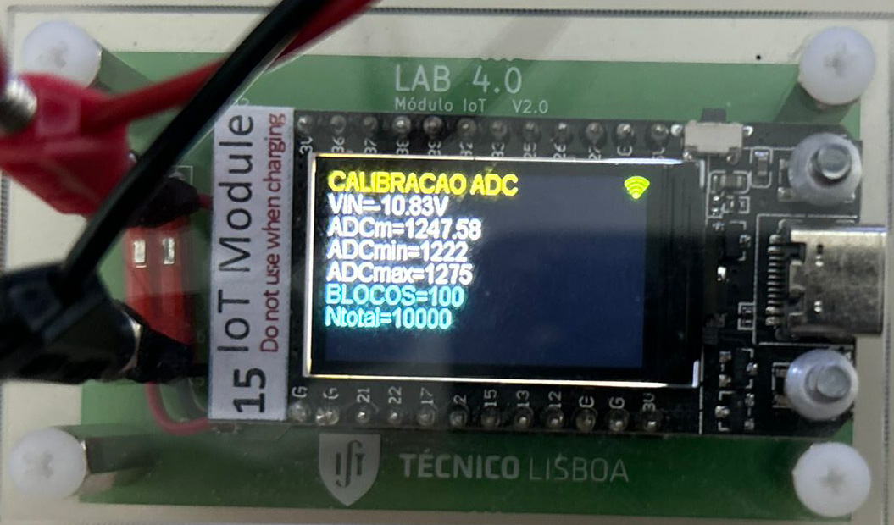
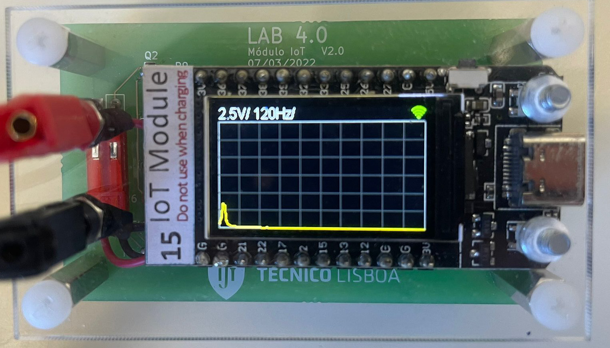

# ESP32 Signal Acquisition, Micro-Oscilloscope and Digital Filter Analysis

This portfolio project brings together two **Sistemas Eletrónicos** Lab 3 deliverables:

1. An embedded MicroPython application that turns an ESP32/TFT laboratory module into a small signal-acquisition instrument.
2. An independent MATLAB analysis of a synthetic sampled signal using IIR and FIR digital filters.

The embedded application samples the ADC, converts the raw values using experimental calibration data from **Module 14**, renders the time-domain waveform, and computes a manual discrete Fourier transform (DFT) for a frequency-domain view.




## What it demonstrates

| Area | Implementation |
| --- | --- |
| Data acquisition | 240 ADC samples over a selectable acquisition window |
| Calibration | Module-specific linear ADC calibration with the laboratory input-divider factor of `1 / 29.3` |
| Embedded interface | TFT grid, waveform/spectrum drawing, status bar and button-driven controls |
| Signal analysis | Vmax, Vmin, mean, RMS and a manually calculated DFT |
| Data export | Optional email of the most recent acquisition through the laboratory display library |

## Controls

| Button event | Action |
| --- | --- |
| Button 1, short press | Acquire and redraw the waveform |
| Button 1, long press | Email the latest data when an address is configured |
| Button 2, short press | Change vertical scale |
| Button 2, long press | Change time scale |
| Button 2, double press | Show the DFT magnitude spectrum |

## Hardware and dependency

The application targets the ESP32/TFT module used in the laboratory. It requires the authorised `T_Display` MicroPython library, which is **not included** here because it was supplied for the laboratory environment.

Before deploying `src/main.py` to a device:

1. Install the required laboratory library through the authorised hardware/course distribution.
2. Configure `DEVICE_ID` only if that deployment requires one.
3. Set `MAIL_ADDRESS` locally only if the email feature is wanted; it is deliberately empty in this repository.
4. Recalibrate the ADC if the module or the analogue input circuit differs from the original setup.

The code is hardware-specific; a desktop Python interpreter can check its syntax but cannot exercise acquisition, buttons, display or email delivery.

## Calibration

The values embedded in `src/main.py` come from five bench measurement points on **Module 14**, each based on 10,000 ADC samples. The full measurement table, regression and all experimental captures retained from the report are in [docs/micro-oscilloscope-results.md](docs/micro-oscilloscope-results.md); the conversion equations are in [docs/calibration.md](docs/calibration.md).

## Digital-filter analysis

The companion MATLAB script, [src/digital-filter-analysis.m](src/digital-filter-analysis.m), analyses the same Lab 3 signal-processing context:

- IIR band-pass filter designed by bilinear transformation;
- FIR low-pass filters using rectangular and Hanning windows;
- time- and frequency-domain comparisons; and
- estimated stop-band attenuation, transition width and group delay.

All technical figures and tables used to document that analysis are retained in [docs/digital-filter-analysis.md](docs/digital-filter-analysis.md). Running the script requires MATLAB and the relevant signal-processing functions.

## Repository contents

```text
src/main.py            MicroPython application
src/digital-filter-analysis.m
                       MATLAB IIR/FIR design and analysis
docs/calibration.md    Clean calibration summary and conversion model
docs/digital-filter-analysis.md
                       Figures and tables from the digital-filter analysis
assets/                Laboratory photographs and analysis figures without personal data
```

## Academic provenance

Developed by a three-person team as an academic project for **Sistemas Eletrónicos** at Instituto Superior Técnico. This is a cleaned portfolio presentation of the embedded application; it intentionally excludes course handouts, course-supplied library code, raw backups, reports and files containing personal data. It is not presented as a solo project.

## Verification performed for this portfolio version

- `src/main.py` passes a CPython syntax check.
- The calibration constants were checked against the original measurement workbook.
- Hardware behaviour was not re-run during portfolio preparation; it requires the ESP32/TFT laboratory module and its authorised library.
