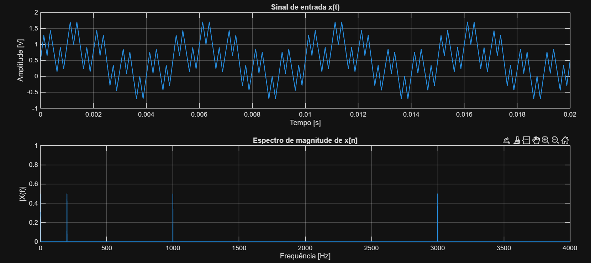
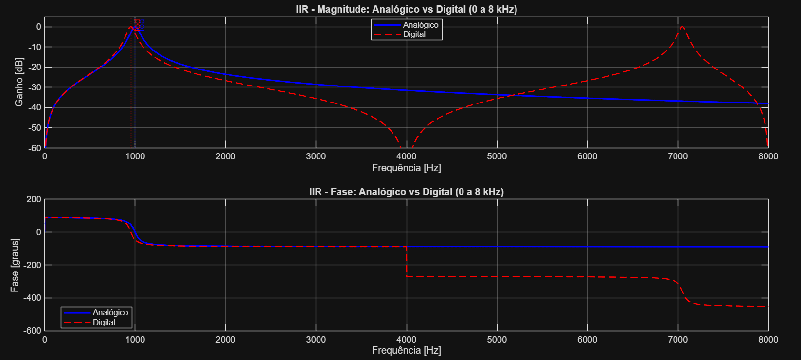
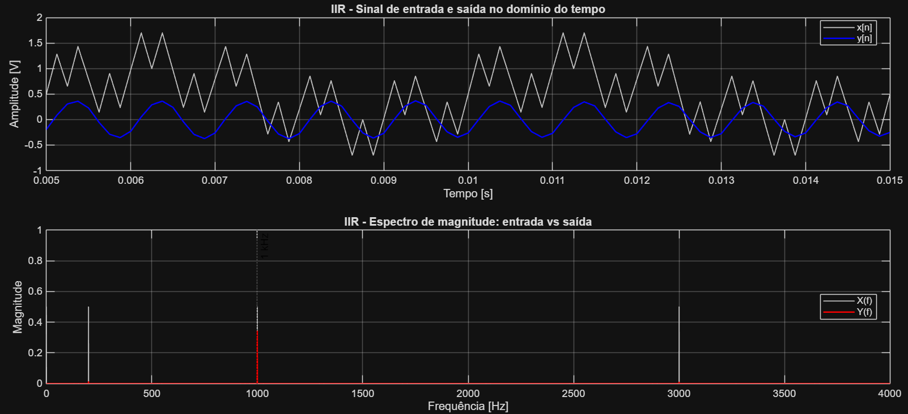
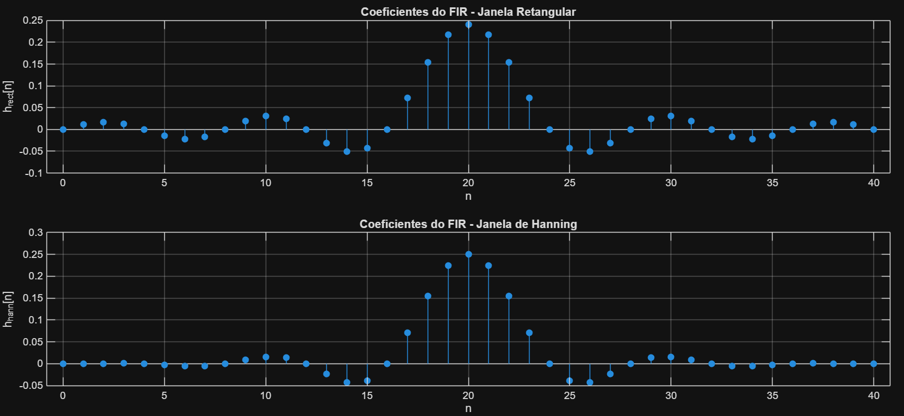
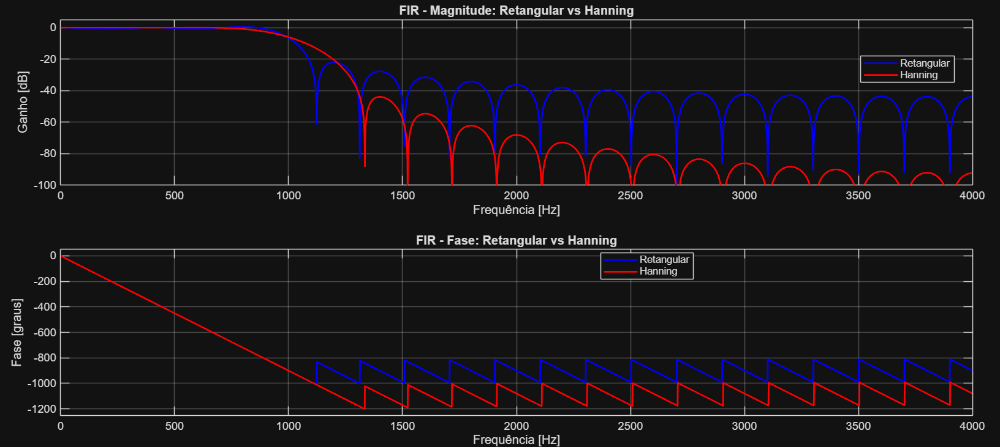
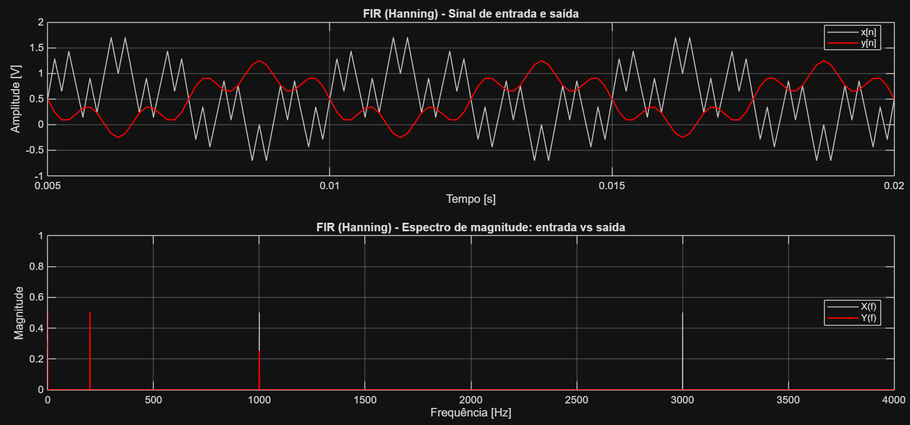
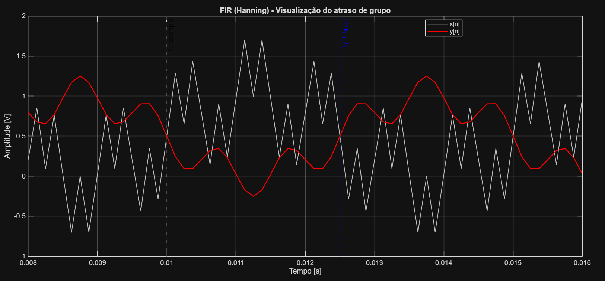

# Digital filter analysis

This document preserves the technical results and visual evidence of the Lab 3 IIR/FIR analysis. The executable MATLAB source is [digital-filter-analysis.m](../src/digital-filter-analysis.m).

## Input signal

The analysis uses a signal sampled at `8 kHz` with a DC term and sinusoidal components at `200 Hz`, `1000 Hz` and `3000 Hz`.



## IIR band-pass filter

| Parameter | Value |
| --- | --- |
| Type | Band-pass |
| Centre frequency | 1 kHz |
| Gain | 0 dB at f0 |
| Quality factor Q | 10 |
| Sampling frequency | 8 kHz |

The analogue reference model was transformed to a digital IIR filter using the bilinear transformation. The resulting coefficients are:

```text
b = [0.032903632, 0, -0.032903632]
a = [1, -1.417343694, 0.934192736]
```



| Model | Analogue | Digital | Difference |
| --- | ---: | ---: | ---: |
| Centre frequency (Hz) | 1000 | 953 | -47 |

The output amplitude at `1 kHz`, obtained from the FFT of the filtered signal, was `0.341635 V`.



## FIR low-pass filters

| Parameter | Value |
| --- | --- |
| Type | Low-pass |
| Pass frequency | 1 kHz |
| Gain | 0 dB at DC |
| Sampling frequency | 8 kHz |
| Number of coefficients N | 41 |

### Window reference values

| Window | Transition width (normalised) | Ap (dB) | Ripple delta | Secondary lobe | As (dB) |
| --- | ---: | ---: | ---: | ---: | ---: |
| Rectangular | 0.9 / N | 0.7410 | 0.0890 | -13 dB | 21 |
| Hanning | 3.1 / N | 0.0546 | 0.0063 | -31 dB | 44 |





### Estimated and reference results

| Window | As reference (dB) | As estimated (dB) | Transition width reference (Hz) | Transition width estimated (Hz) |
| --- | ---: | ---: | ---: | ---: |
| Rectangular | 21.00 | 31.51 | 87.80 | 168.95 |
| Hanning | 44.00 | 54.71 | 302.44 | 388.67 |

| Metric | Rectangular reference | Rectangular estimated | Hanning reference | Hanning estimated |
| --- | ---: | ---: | ---: | ---: |
| As (dB) | 21.00 | 31.51 | 44.00 | 54.71 |
| Transition width (Hz) | 87.80 | 168.95 | 302.44 | 388.67 |

For `N = 41` and `fs = 8 kHz`, the theoretical FIR group delay is `2.5 ms` (20 samples), matching the simulation result.





## Interpretation

The IIR filter is more selective around `1 kHz`, but the bilinear transformation shifts its digital centre frequency to `953 Hz` and its phase is non-linear. The Hanning-window FIR filter has linear phase and the expected constant delay, but it is low-pass and therefore retains the `200 Hz` component.
